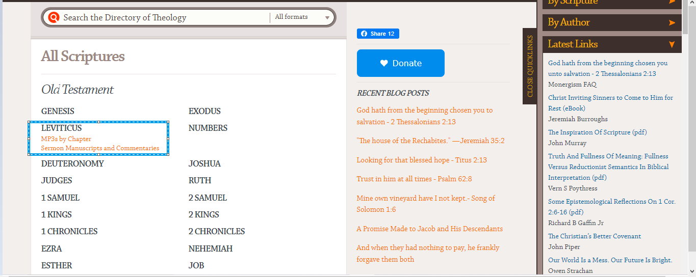

Documentation of the json data structures used in the project 
=============================================================

Documentation of the json data structure used to store the data scrapped from a single web page 
-----------------------------------------------------------------------------------------------

This is the data structure used to scrap metadata from sermonindex and monergism 
**Version : 0.0.1**

Here is an exmple of the json code 

.. code-block:: json 

    {
    "version": "0.0.1",
    "url": "https://www.sermonindex.net/modules/mydownloads/scr_index.php?act=booksList",
    "local_json_filepath": "D:/projet_github/FOR GOD/Scraping general/test_folder\\metadata/sermonindex\\audio_sermon\\elaborated_data\\scripture_list\\file_0.json",
    "local_html_filepath": "D:/projet_github/FOR GOD/Scraping general/test_folder\\metadata/sermonindex\\audio_sermon\\raw_data\\scripture_list\\file_0.html",
    "request_datetime": [
        "2024-10-10T23:23:54.341367Z"
    ],
    "request_header": {
        "Date": "Thu, 10 Oct 2024 21:23:54 GMT",
        "Content-Type": "text/html; charset=UTF-8",
        "Transfer-Encoding": "chunked",
        "Connection": "keep-alive",
        "x-powered-by": "PHP/5.6.40",
        "vary": "Accept-Encoding",
        "strict-transport-security": "max-age=63072000; includeSubDomains",
        "x-frame-options": "SAMEORIGIN",
        "x-content-type-options": "nosniff",
        "Cache-Control": "max-age=0",
        "expires": "Thu, 10 Oct 2024 21:23:53 GMT",
        "CF-Cache-Status": "DYNAMIC",
        "Report-To": "{\"endpoints\":[{\"url\":\"https:\\/\\/a.nel.cloudflare.com\\/report\\/v4?s=JMoegn%2BuGTcUsiq9S3r3zkd0oeyvTUva9YZe8WLUl3VnCaf%2FmXmmrcO1zQKuNmVA3Lh0jR1UedvhJNs3xWtmI3wPHaU1X6xAv1l6vUehy8mOlPlqTTDRFtUi4VDoMYIGRPqdAEYo%2BC%2B96IX%2BYj1XMqI%3D\"}],\"group\":\"cf-nel\",\"max_age\":604800}",
        "NEL": "{\"success_fraction\":0,\"report_to\":\"cf-nel\",\"max_age\":604800}",
        "Server": "cloudflare",
        "CF-RAY": "8d09ac9528046eff-CDG",
        "Content-Encoding": "gzip",
        "alt-svc": "h3=\":443\"; ma=86400"
    },
    "request_status_code": 200,
    "request_cookies": [],
    "request_history": [],
    "list": []

### The important and required fields are 

- **version** (`string`) -  The version of the JSON structure.

- **url** (`string`) -  The url of th web page scrapped 
    
- **local_json_filepath** (`string`) -  The path to the json file where the scrapped data was saved. Most of 
    the time, the name of the json file containing the data 
    The name of the json  
    
- **local_html_filepath** (`string`) -  The path of the html file in which the html text scrapped is saved if it is the 
    case else ""
    
- **request_header** (`object`) -  The header of the request (python requests libray) made to get the html 

- **request_status_code** (`int`) -  The status code of the request 

- **request_cookies** (`list[objet]`) -  A list of object representing the cookies written by the web site 

- **request_history** (`list[objet]`) -  A list of object representing the history of the request if redirections was made 

- **data** (`list[object]`) - The data scrapped from the web page. For example 
A list of object representing the data scrapped from the web site 

This json data structure is used to store data scrapped from web pages. 
This explain the presence of the http request information in this data structure 

Data structure to anchor object content representation 
------------------------------------------------------

Documentation of the data structure used to store the name of an author and the link to it first page,
the same for topic, scriptures on monergism, sermonindex index 

.. code-block:: json 
    
    {
            "version": "0.0.1",
            "name": "Genesis",
            "url_list": [
                "https://www.sermonindex.net/modules/mydownloads/scr_index.php?act=bookSermons&book=Genesis&page=0"
            ]
    }

### The important and required fields are 

- **version** (`string`) -  The version of the JSON structure.
- **name** (`string`) - The name of the athor, topic, scripture, and more 
- **url_list** (`list[str]`) - A list of string containing the url related 
  to this topic, author, scripture or more. For example on monergism, there is 
  two link for each scripture (https://www.monergism.com/scripture).

Here is the json code of the book of Leviticus 

.. code-block:: json 

    {
            "version": "0.0.1",
            "name": "Genesis",
            "url_list": [
                "https://www.monergism.com/topics/sermon-manuscripts-mp3s-scripture/genesis/audio-and-multimedia/chapter-genesis",
                "https://www.monergism.com/topics/sermon-manuscripts-mp3s-scripture/genesis"
            ]
    }